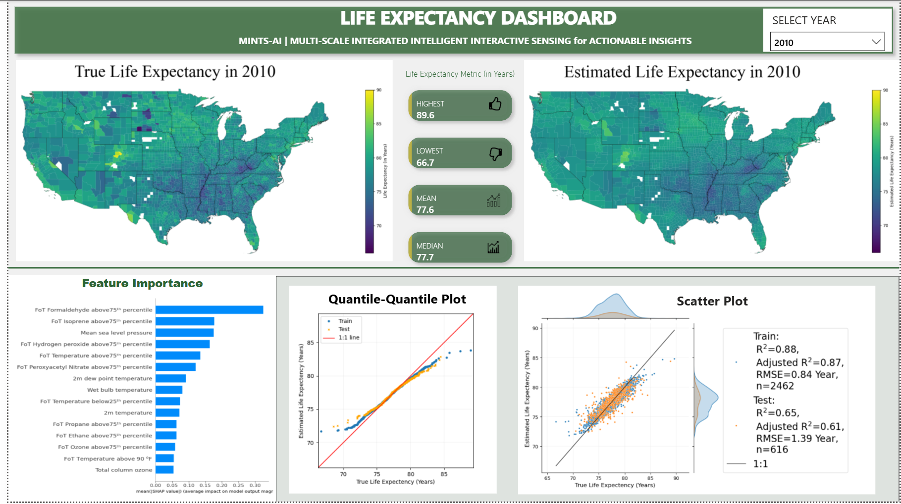
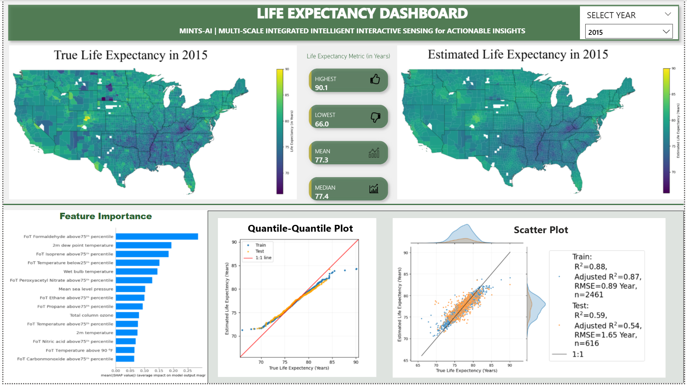
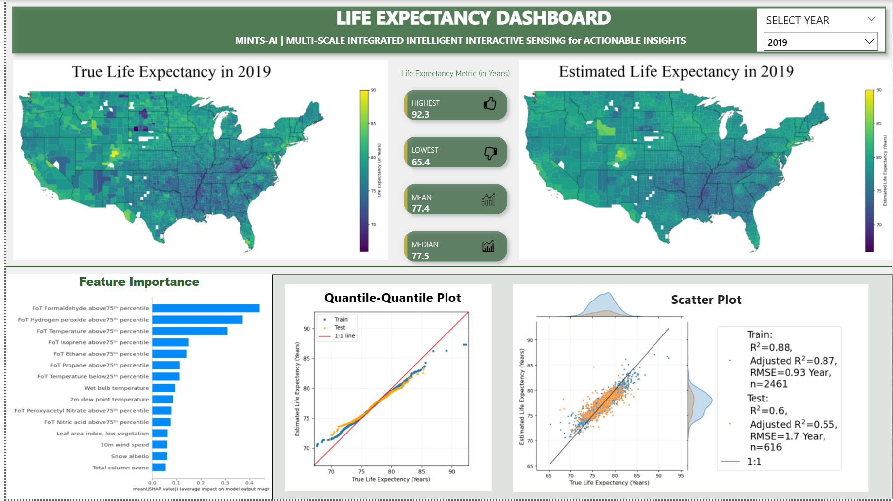

#### Repository to create PowerBi dashboard for the Life expectancy project.

Files:
- Figures: consists of the Figures used in the dashboard
- estimation: consists the code to estimate and the results
- icons: the icons used the dashboard and the attribution
- environment.yml: the environment file
- life_expectancy_powerbi.pbix: the dashboard. 
- pictures.xlsx: excel file to link pictures to other table
- final_dataset_103_features.pkl: The dataset used to estimate the life expectancy

A view of the Dashboard is below:

#### Year 2010

#### Year 2015

#### Year 2019
